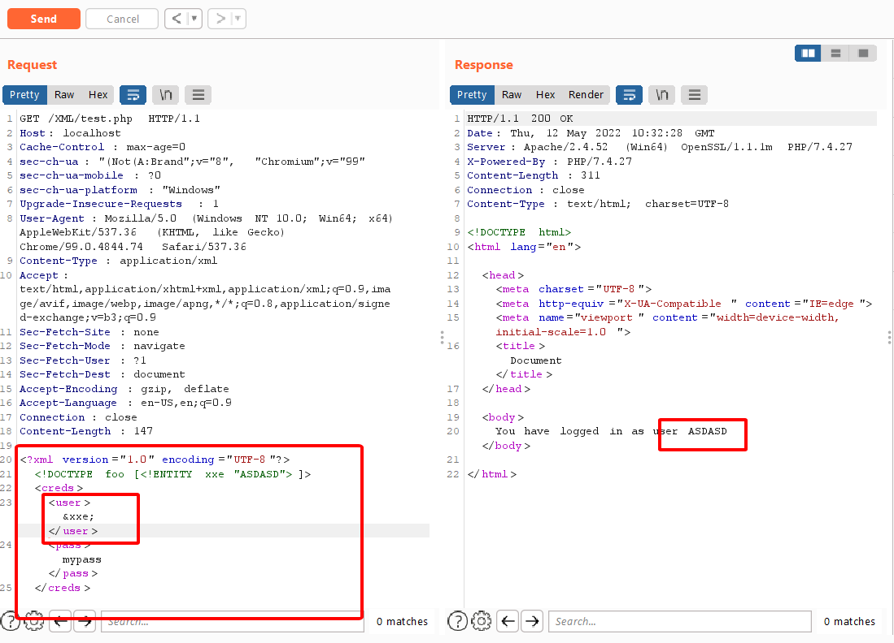

Người thực hiện: Lê Trần Văn Chương.

Thời gian: 11/05/2020.

Mục lục:
- [XML external entity (XXE) injection](#xml-external-entity-xxe-injection)
- [Lab](#lab)

## XML external entity (XXE) injection 
- XML external entity (XXE) injection là một lỗ hổng bảo mật web cho phép kẻ tấn công can thiệp vào quá trình xử lý dữ liệu XML của ứng dụng. Nó thường cho phép kẻ tấn công xem các tệp trên hệ thống tệp của máy chủ ứng dụng và tương tác với bất kỳ hệ thống bên ngoài hoặc bên trong nào mà chính ứng dụng có thể truy cập.
- Một số ứng dụng sử dụng định dạng XML để truyền dữ liệu giữa trình duyệt và máy chủ. Các ứng dụng thực hiện điều này hầu như luôn sử dụng thư viện chuẩn hoặc API nền tảng để xử lý dữ liệu XML trên máy chủ. Các lỗ hổng XXE phát sinh do đặc tả XML chứa nhiều tính năng nguy hiểm tiềm ẩn khác nhau và trình phân tích cú pháp tiêu chuẩn hỗ trợ các tính năng này ngay cả khi chúng không được ứng dụng sử dụng bình thường.

## Lab
- Trang dưới đây nó sẽ in ra element `user` của xml.

- Tôi sẽ thử chèn thêm đoạn code sau `<!DOCTYPE foo [ <!ENTITY xxe "ASDASD"> ]>` vào xml và giá trị `user` tôi sẽ thay bằng `&xxe;` để hiện kết quả lên (hình dưới).
    - `DOCTYPE foo` - Xác định rằng phần tử gốc của tài liệu là `foo`.
    - `ENTITY xxe` - Nó sẽ giống như biến trong lập trình và biến này có tên là `xxe`.
    - Để gọi biến trong element thì ta sử dụng cú pháp `&tên-biến;` ở đây là `&xxe;`.

- Tiếp theo, tôi sẽ chèn thêm đoạn code sau `<!DOCTYPE foo [<!ENTITY xxe SYSTEM "file:///C:/Windows/System32/drivers/etc/hosts">]>` - (nghĩa là trỏ đến tệp hosts của system bên ngoài và lấy dữ liệu của nó ra và đẩy lên element `user`). Kết quả (hình dưới).

